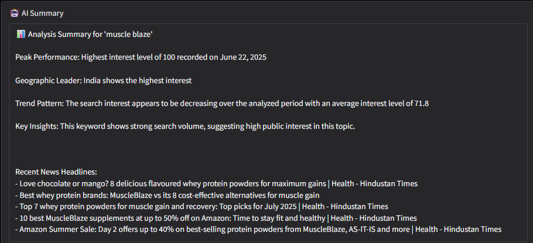
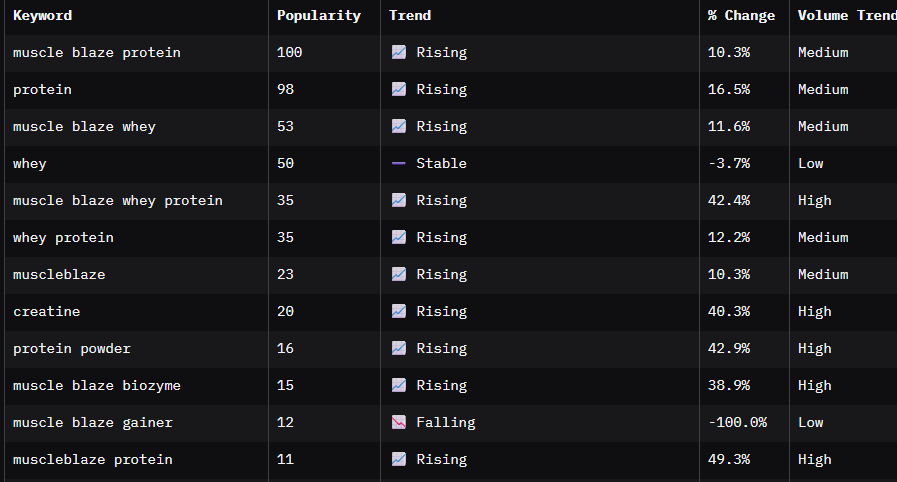
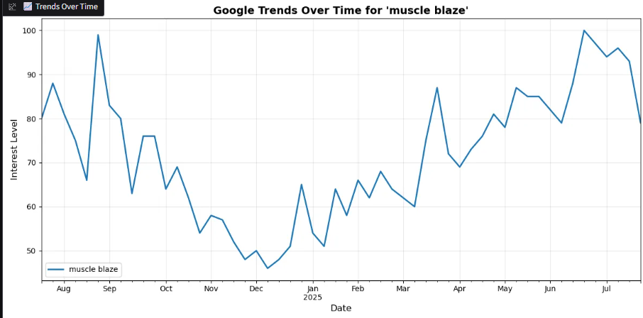

# 🚀 Competitor Analyzer

**Competitor Analyzer** is an AI-powered Python tool that helps track **keyword trends**, **Google search interest**, and **competitor visibility** across the web. Perfect for digital marketers, SEO analysts, content strategists, and businesses aiming to stay ahead of their competition.

---

## 🔍 Features

- 📈 **Google Trends Integration**  
  Get historical and real-time data for multiple keywords using `pytrends`.

- 🌐 **Web Scraping with Selenium + BeautifulSoup**  
  Extract top search results and metadata to analyze competitor presence.

- 📊 **Interactive Data Visualization**  
  View keyword trends, growth patterns, and competitor performance using:
  - `matplotlib`
  - `plotly`

- 🤖 **AI Chat Interface (Gradio)**  
  Ask questions like:  
  > “Which keyword is trending faster?”  
  > “Show me a competitor comparison for last 30 days.”

---

## 🗂️ File Structure

competitor-analyser/
│
├── main.py # Main application logic
├── ai_interface.py # Gradio-based AI chat interface
├── keyword_utils.py # Helper functions for keyword analysis
├── plots.py # Matplotlib & Plotly graph utilities
├── requirements.txt # Python dependencies
└── README.md # You’re reading it!


---

## ⚙️ Setup Instructions

### 🔧 Prerequisites

- Python 3.9 – 3.11 (🛑 Python 3.12 not fully compatible with some libs)
- Chrome browser
- ChromeDriver

### 📦 Install Dependencies

```bash
# Create virtual environment (optional but recommended)
python -m venv venv
source venv/bin/activate  # on Windows: venv\Scripts\activate

# Install required libraries
pip install -r requirements.txt
```
📊 Example Output
Keyword trend line graphs

Top 10 competitors per keyword

Growth rate predictions using Linear Regression

AI chat summaries like:

"Which brand leads in search volume over time?"


🧠 Tech Stack
Python 🐍
Gradio 🤖
Matplotlib & Plotly 📊
PyTrends 🔍
SerpAPI 🔑
Selenium + BeautifulSoup 🌐

## 📸 Screenshots

### 1. 🧠 AI Chat Interface


---

### 2. 📈 Keyword Trend Comparison


---

### 3. 📊 Competitor Search Result Table


---

